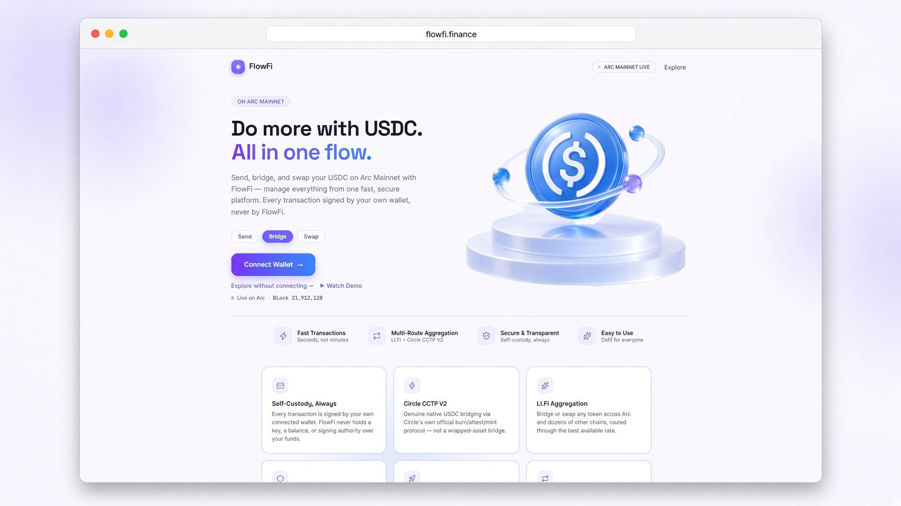

# FlowFi

Native USDC on Arc — live on **Arc Mainnet** for Home, Bridge, Swap, Dashboard, and History; a full permissionless DeFi showcase (Circle Wallet, Token Launch, Liquidity Pools, CCTP, Gateway) still running on **Arc Testnet**.

**App:** [flowfi.finance](https://flowfi.finance) · **Repo:** [github.com/sekuler/flowfi](https://github.com/sekuler/flowfi)

One loop on mainnet: connect a wallet → bridge or swap real USDC on Arc, through already-live infrastructure (LI.FI, and Circle's own CCTP V2 contracts) — not FlowFi's own contracts.

| | |
|---|---|
| **Mainnet Bridge & Swap** | Routed through LI.FI, or sent directly through Circle's CCTP V2 contracts — real funds never touch a FlowFi-run contract |
| **Self-custody only, mainnet** | Every mainnet transaction is signed by the user's own wallet. FlowFi holds no keys, no custody, no hot wallet |
| **Circle Wallet** *(Testnet)* | Seedless — sign in with email. Full Developer-Controlled Wallet flow, kept on testnet by design — see "Why Circle Wallet stays on Testnet" below |
| **Gateway & CCTP V2** *(Testnet)* | One USDC balance across 4 chains; official Circle burn/attest/mint |
| **Safe 2-of-3** | Owns every privileged testnet contract |

[](https://github.com/sekuler/flowfi/actions/workflows/ci.yml)

> **Two environments, on purpose.** Mainnet (real funds) is intentionally the smaller surface: Home, Bridge, Swap, Dashboard, History, and an AI Copilot that never signs or executes anything — all built on third-party infrastructure that was already live before FlowFi touched it, with every signature coming from the user's own wallet. Testnet (test USDC/EURC, no monetary value) is where FlowFi's own contracts — Token Launch, Liquidity Pools, Circle Wallet, CCTP, Gateway — live as a full working showcase. See [SECURITY.md](./SECURITY.md) for the reasoning behind that split.

---

## Live on Arc Mainnet

| Feature | What it does |
|---|---|
| **Home** | Net worth in dollars, the assets held (USDC, EURC, USYC, cirBTC), quick actions for Bridge / Swap / Add funds, an "Ask your wallet" box that answers questions about your balance and activity (read-only), and recent activity in plain language ("Received 1.4713 EURC") |
| **Bridge — Any token** | Move USDC or any other asset onto or off Arc from any chain LI.FI supports, with LI.FI's route comparison so the user picks the fastest or cheapest route. Signed entirely by the user's connected wallet |
| **Bridge — Native USDC** | A direct integration with Circle's own CCTP V2 contracts from 18 source chains: the USDC is burned on the source chain, Circle attests the burn, and native USDC is minted on Arc — no wrapped token. Shows Circle's published fee and the average wait for the chosen chain (from Circle's finality docs). A transfer interrupted after the burn can be resumed, so it is never burned twice |
| **Swap** | Same-chain swaps on Arc through LI.FI. Opens on USDC → EURC, with quick token picks from the tokens LI.FI lists on Arc |
| **Dashboard** | Net worth, live USDC / EURC balances, portfolio split, activity mix, and recent activity. Balances are read from the chain; activity comes from Arc's official Etherscan-run explorer (`arc.etherscan.io`) |
| **History** | Every transaction and token transfer on the wallet's address, including ones made in other apps: sends, receives, approvals, swaps, bridge mints, and LI.FI routes, with amounts and explorer links |
| **AI Copilot (Mainnet)** | Recognizes a bridge/swap request in plain language and takes the user to the right page to confirm with their own wallet — it never signs or executes anything itself on mainnet |

No FlowFi-deployed contract is involved in any of the above. FlowFi is a frontend and router here, not a counterparty. The net-worth chart and 7-day change are drawn from daily snapshots saved in the user's own browser (not on a FlowFi server); until enough days have been recorded they say "Not enough history" instead of showing a made-up curve. USD values for EURC, USYC, and cirBTC use live prices; if a price can't be fetched, that token is left out of the dollar total rather than guessed.

**Mainnet contracts the frontend reads or calls** (none deployed by FlowFi):

| Contract | Address |
|---|---|
| USDC (ERC-20 interface, 6 decimals) | `0x3600000000000000000000000000000000000000` |
| EURC *(Circle-official)* | `0xbEf5f6d51CB62b58e6A8f77868681825C6fe21c1` |
| USYC | `0x8a5D989Bbb96929F689B0200f435f53dA42bF490` |
| cirBTC *(Circle-official, 8 decimals)* | `0x171A4217b86A807A64eB94757Db6849fb4bDbAA0` |
| CCTP V2 TokenMessengerV2 *(Circle-official)* | `0x28b5a0e9C621a5BadaA536219b3a228C8168cf5d` |
| CCTP V2 MessageTransmitterV2 *(Circle-official)* | `0x81D40F21F12A8F0E3252Bccb954D722d4c464B64` |

## Full showcase on Arc Testnet

| Feature | What it does |
|---|---|
| **Circle Wallet** | FlowFi provisions a Developer-Controlled Wallet and tracks its per-chain wallet IDs — no seed phrase, no browser extension, one consistent address surfaced across all four supported testnet chains. Can be used as your only login, or alongside a browser wallet |
| **Bridge & Gateway** | One page, two modes. Bridge: genuine cross-chain USDC transfer via Circle's official burn/attest/mint CCTP V2 protocol — Arc, Ethereum Sepolia, Base Sepolia, Arbitrum Sepolia. Gateway: a unified USDC balance via Circle's Gateway protocol — deposit once, held as one pooled balance instead of four separate on-chain balances. Both work from either a browser wallet or the Circle Wallet |
| **Smart Swap** | USDC ⇄ EURC with an AI advisor that reads real pool liquidity and warns before a swap moves the price too much |
| **Permissionless Token Launch** | Deploy your own ERC-20 on Arc and open its own trading pool immediately — no waiting on anyone's approval, scoped so it never touches the curated pools' security model |
| **Liquidity Pools** | A working showcase pool (USDC/EURC) demonstrating the swap rail — anyone can add/remove liquidity or swap against it |
| **Stablecoin Analytics** | Live, on-chain TVL and distribution across every FlowFi testnet contract |
| **AI Copilot (Testnet)** | Type what you want — "swap 10 USDC to EURC", "send 20 USDC to 0x..." — Copilot parses it and executes the on-chain transaction directly, signed by the connected wallet |
| **AI Market Analysis** | Ask "analyze BTC" or "analyze Morpho" and get real technical analysis (RSI, EMA, MACD, pivot support/resistance across 1H/4H/1D/1W/1M) and tokenomics/unlock data — all numbers computed server-side from live data, with the AI only writing the interpretive summary, never the figures. Works from either environment |

### Why Circle Wallet stays on Testnet

Circle's own console confirms Arc Mainnet wallet creation is technically available now. FlowFi still isn't turning it on for real funds: a custodial wallet product — FlowFi's backend holding signing authority over a user's private key, even briefly, even non-exportable — is a regulated activity in a growing number of jurisdictions, including Türkiye (7518 sayılı Kanun brought custody and transfer/exchange services under SPK licensing as of July 2024). Rather than operate that model for real money without the applicable license, FlowFi kept every mainnet flow strictly self-custodial: the user's own wallet signs every transaction, FlowFi never holds a key or a balance. Circle Wallet, Token Launch, and Liquidity Pools stay exactly where they've been fully exercised and demonstrated — Testnet, no monetary value, no licensing question — rather than being rushed onto mainnet under real-money rules they weren't built for.

---

## Smart contracts (Arc Testnet)

The live testnet product surface only — every `onlyOwner` contract here is owned by a 2-of-3 Safe multisig (`0xa50FFedfC93eDB81F8Bcc23507db8aDdE7EE8Be0`), not a single wallet. Superseded/legacy versions (still live on-chain, no longer where the app sends traffic) are documented separately in [`contracts/LEGACY.md`](./contracts/LEGACY.md), not deleted from the record. Arc Mainnet has no equivalent contracts — Bridge/Swap there route through LI.FI, and native USDC transfers go through Circle's own CCTP V2 contracts, not a FlowFi deployment.

| Contract | Address |
|---|---|
| Pool Factory v4c *(current — where new pools actually get created)* | `0xD2dC496dcf4e6D8c9CFc710AC5C9A6Dc941CBbB0` |
| Launch Pool Factory *(permissionless, but only for tokens minted through Token Factory below — see [`contracts/README.md`](./contracts/README.md); not yet independently reviewed)* | `0x2b3B2E69C14DA2558E3ce6e2d58c04b2147E5ec0` |
| Token Factory (v2) | `0x1Fe800a2663988C043e4a9A393651f18Cd49D998` |
| USDC (Arc Testnet) | `0x3600000000000000000000000000000000000000` |
| EURC | `0x89B50855Aa3bE2F677cD6303Cec089B5F319D72a` |
| CCTP V2 TokenMessengerV2 *(Circle-official)* | `0x8FE6B999Dc680CcFDD5Bf7EB0974218be2542DAA` |
| CCTP V2 MessageTransmitterV2 *(Circle-official)* | `0xE737e5cEBEEBa77EFE34D4aa090756590b1CE275` |
| Gateway Wallet *(Circle-official)* | `0x0077777d7EBA4688BDeF3E311b846F25870A19B9` |
| Gateway Minter *(Circle-official)* | `0x0022222ABE238Cc2C7Bb1f21003F0a260052475B` |

All verified and viewable on [Arcscan Testnet](https://testnet.arcscan.app). Arc Mainnet activity is viewable on [arc.etherscan.io](https://arc.etherscan.io). Full security review: [`SECURITY.md`](./SECURITY.md). CCTP/Gateway addresses confirmed against [Arc's official contract addresses page](https://docs.arc.io/arc/references/contract-addresses) and [Circle Gateway docs](https://developers.circle.com/gateway).

One more deployed and verified contract, Escrow v4, isn't in the table above because it isn't wired into the app yet — see [`contracts/README.md`](./contracts/README.md) for it.

---

## Verified receipts — real transaction hashes

Every claim above is checkable on-chain. Rather than asking anyone to take our word for it, here are real transaction hashes from live demo runs — click through to the relevant explorer to see them settle.

**Demo 1 — Cross-chain bridge, Testnet (Ethereum Sepolia → Arc)**
| Step | Tx hash |
|---|---|
| Source burn (Ethereum Sepolia) | [`0x2920de716bea703082e373d6b711354f6ce4d5076a1783fdb73e0094adfecc51`](https://sepolia.etherscan.io/tx/0x2920de716bea703082e373d6b711354f6ce4d5076a1783fdb73e0094adfecc51) |
| Destination mint (Arc) | [`0x77a9b887dadd47dd6a80d029d8aedee659f730e529ab4a624dd8518226d61695`](https://testnet.arcscan.app/tx/0x77a9b887dadd47dd6a80d029d8aedee659f730e529ab4a624dd8518226d61695) |

**Demo 2 — Circle Developer-Controlled Wallet executing a swap on Arc, Testnet**
| Step | Tx hash |
|---|---|
| On-chain execution | [`0x0226fc2c8b4cd4000bd25c6aea358f553aed9e69cc69b36582c0b2c7568146c0`](https://testnet.arcscan.app/tx/0x0226fc2c8b4cd4000bd25c6aea358f553aed9e69cc69b36582c0b2c7568146c0) |

All transactions were confirmed successful on their respective explorers as of this writing. See [`docs/demo.md`](./docs/demo.md) for a full walkthrough.

---

## Why Arc?

FlowFi is designed around stablecoins, not speculation.

Being honest about it: CCTP V2 and Circle Developer-Controlled Wallets aren't Arc-exclusive — they work on other supported EVM chains too. What's actually Arc-specific is what happens after funds arrive. USDC is Arc's native gas asset, not a wrapped placeholder bolted onto a general-purpose chain — so cross-chain USDC becomes immediately productive the moment it lands, with no synthetic-asset discount and no "why is gas a random token" friction to explain away.

FlowFi is built around that arrival point — bridging, swaps, and token tools all settle through the same native-USDC rail, instead of being stitched together across incompatible chains and bridge providers.

There's a second, independent reason Arc specifically: it runs on Malachite, a consensus engine built for sub-second deterministic finality — once a transaction confirms, it's final, no reorg risk. That's not a Circle-product claim that applies elsewhere; it's Arc's own chain-level property, and it's why FlowFi doesn't need to hedge language like "should be confirmed" around settlement.

---

## Architecture

**Mainnet — real funds, self-custody only:**

```
┌─────────────────────────────────────────────┐
│                  Frontend                    │
│        React + TypeScript + viem             │
└──────────────────┬────────────────────────────┘
                    │
            ┌───────▼────────┐
            │ Browser Wallet   │
            │ (EIP-6963)       │  ← every mainnet tx signed here, never by FlowFi
            └───────┬────────┘
                     │
       ┌─────────────▼──────────────┐
       │  LI.FI + Circle CCTP V2      │  ← third-party, already live
       └─────────────┬───────────────┘
                      │
              ┌───────▼────────┐
              │   Arc Mainnet    │
              └─────────────────┘
```

**Testnet — full FlowFi-built showcase:**

```
┌─────────────────────────────────────────────┐
│                  Frontend                    │
│        React + TypeScript + viem             │
└──────────────────┬────────────────────────────┘
                    │
        ┌───────────┼────────────┐
        │           │            │
┌───────▼──────┐ ┌──▼─────────┐ ┌▼─────────────┐
│ Browser Wallet│ │Circle Wallet│ │  AI Copilot  │
│ (EIP-6963)    │ │(no seed phr)│ │(Claude Sonnet)│
└───────┬──────┘ └──┬─────────┘ └┬─────────────┘
        │           │            │
        └───────────┼────────────┘
                     │
       ┌─────────────▼──────────────┐
       │      Arc Testnet (L1)       │
       │  Swap · TokenFactory ·      │
       │      PoolFactory            │
       └─────────────┬───────────────┘
                      │ CCTP V2
       ┌──────────────┼───────────────┐
       │              │               │
┌──────▼─────┐ ┌──────▼─────┐ ┌───────▼──────┐
│ Eth Sepolia│ │Base Sepolia│ │Arbitrum Sepolia│
└────────────┘ └────────────┘ └────────────────┘
```

---

## Screenshots

| | |
|---|---|
| **Landing**<br>Connect a wallet or explore without connecting |  |
| **Home**<br>Net worth, assets, Ask your wallet, recent activity |  |
| **Bridge**<br>Any token via LI.FI, or native USDC via Circle CCTP V2 |  |
| **Swap**<br>Same-chain swaps on Arc, opens on USDC → EURC |  |
| **Dashboard**<br>Balances, portfolio split, activity mix |  |
| **History**<br>Transactions and token transfers, with amounts |  |

These are the Arc Mainnet screens. The Testnet showcase (Circle Wallet, Token Launch, Liquidity Pools, Stablecoin Analytics) is in the same app under the Testnet menu.

---

## Data sources

FlowFi's market analysis never uses AI-generated numbers — every figure comes from a real source:

| Data | Source | Notes |
|---|---|---|
| Price, market cap, volume, supply | [CoinGecko](https://coingecko.com) | Free tier |
| RSI, EMA, MACD, support/resistance | Computed server-side | Standard formulas, real historical OHLCV — not AI-generated |
| Mainnet net-worth prices (EUR/USD via EURC, USYC, BTC via cirBTC) | [CoinGecko](https://coingecko.com) | A token with no live price is left out of the dollar total, not guessed |
| Token unlock/vesting schedules | 57 tokens manually curated from [DeFiLlama](https://defillama.com), cross-checked against official project docs — plus live data from the DropsTab API for any token they track | Manual list is the fallback; DropsTab is checked first |

If a data point isn't available from a real source, FlowFi says so rather than guessing.

---

## Tech stack

- **Frontend** — React, TypeScript, Vite
- **Chain interaction** — [viem](https://viem.sh)
- **Wallets** — EIP-6963 (MetaMask, Rabby, etc.) and WalletConnect for mobile browsers; Circle Developer-Controlled Wallets on Testnet only
- **Mainnet routing** — LI.FI (bridge/swap aggregation, route comparison) and Circle CCTP V2 called directly for native USDC transfers
- **Testnet bridging** — Circle CCTP V2
- **AI** — Claude Sonnet, used for natural-language transaction parsing, swap risk analysis, and market analysis summaries (never for computing the underlying numbers)
- **Charts** — lightweight-charts
- **Hosting** — Vercel

---

## Running locally

```bash
git clone https://github.com/sekuler/flowfi.git
cd flowfi
npm install

cp .env.example .env
# then fill in:
# ANTHROPIC_API_KEY=       (server-side only — no VITE_ prefix, or it gets bundled into client-side JS)
# CIRCLE_API_KEY=          (Testnet-scoped — Circle Wallet stays on Testnet, see "Why Circle Wallet stays on Testnet" above)
# CIRCLE_ENTITY_SECRET=
# VITE_LIFI_API_KEY=       (client-exposed by design, like a publishable key — powers Mainnet Bridge/Swap)
# RELAY_API_KEY=           (server-side only — used via api/relay-proxy)
# ETHERSCAN_API_KEY=       (server-side only — powers Mainnet Home/Dashboard/History activity and token-transfer reads via arc.etherscan.io)
# DROPSTAB_API_KEY=        (optional — live token unlock data; falls back to the manual list without it)
# ARC_RPC_URL=             (optional — a keyed RPC provider for Arc Testnet; falls back to the public RPC)
# ARC_MAINNET_RPC_URL=     (optional — falls back to Arc's own public mainnet RPC)
# UPSTASH_REDIS_REST_URL=  (optional — shared rate limiting for /api/claude and /api/dropstab, and the
# UPSTASH_REDIS_REST_TOKEN= explorer-proxy cache; rate limiting/caching is off entirely, not approximated, if unset)

npm run dev
```

Local dev defaults to Arc Testnet for the full showcase — no real funds are ever involved there. Get test USDC from [faucet.circle.com](https://faucet.circle.com). Mainnet features (Home/Bridge/Swap/Dashboard/History) work locally too, against real Arc Mainnet, the moment a browser wallet is connected — same as production.

---

## Testing

Contracts have a Foundry test suite covering the fixes documented in [`SECURITY.md`](./SECURITY.md) — the ArcEscrow refund loophole, ArcSwap's withdrawLiquidity/setRate restrictions, and ArcPool's fee-on-transfer and non-standard-token (USDT-style) handling — plus happy-path coverage for each contract.

```bash
curl -L https://foundry.paradigm.xyz | bash
foundryup

forge install foundry-rs/forge-std --no-git --no-commit
forge test -vv
```

CI ([`.github/workflows/ci.yml`](./.github/workflows/ci.yml)) runs this suite plus a frontend type-check (`tsc --noEmit`) on every push and pull request to `main`.

---

## Known Limitations

FlowFi's own Testnet contracts have been through a manual security review, not a professional third-party audit. Deliberate design trade-offs from that review (no oracle on ArcSwap's pricing, no TWAP on pools, no admin kill-switch on individual pools by design) are documented in full — not hidden — in [`SECURITY.md`](./SECURITY.md). Mainnet real-money flows (Bridge/Swap/Dashboard/History) sidestep this question entirely by never running a FlowFi contract in the first place — see [`SECURITY.md`](./SECURITY.md) for the full reasoning.

---

## Roadmap

- [ ] Mainnet Liquidity Pools / Token Launch — revisit once a professional third-party audit and appropriate regulatory footing are both in place; deliberately not rushed
- [ ] Cross-chain intent engine — extend mainnet routing to handle multi-step actions automatically
- [ ] Native yield routing across liquidity positions, once Pools has a mainnet path

**Not on the roadmap:** Perpetuals was fully removed (app, Copilot, and frontend code) after a security review found no oracle backs the pricing. A contract from that era is still deployed and verified on Arcscan for historical/audit reference, but there's no plan to rebuild the feature without a real decentralized oracle integration.

---

## Legal

- [`TERMS.md`](./TERMS.md) — what you're agreeing to by using FlowFi
- [`PRIVACY.md`](./PRIVACY.md) — what data is collected, by whom, and why
- [`RISK.md`](./RISK.md) — mainnet-specific risks (wrong network, third-party routing, no undo)
- [`SECURITY.md`](./SECURITY.md) — the security self-review and mainnet trust model

These are also linked from the app itself (sidebar footer).

---

## Disclaimer

Arc Mainnet features (Bridge, Swap) move real USDC and other assets — every transaction is signed by the user's own connected wallet, at the user's own discretion; FlowFi never holds a key, a balance, or signing authority over mainnet funds. Everything else in this README (Circle Wallet, Token Launch, Liquidity Pools, CCTP, Gateway) runs on Arc Testnet with test assets that carry no monetary value. An earlier Perpetuals contract remains deployed and verified on Arcscan for historical reference — it was fully removed from the app and isn't reachable through the product; if you interact with its bytecode directly, be aware its pricing was client-submitted with no decentralized oracle behind it. See [`TERMS.md`](./TERMS.md), [`PRIVACY.md`](./PRIVACY.md), and [`RISK.md`](./RISK.md) for the full terms.
