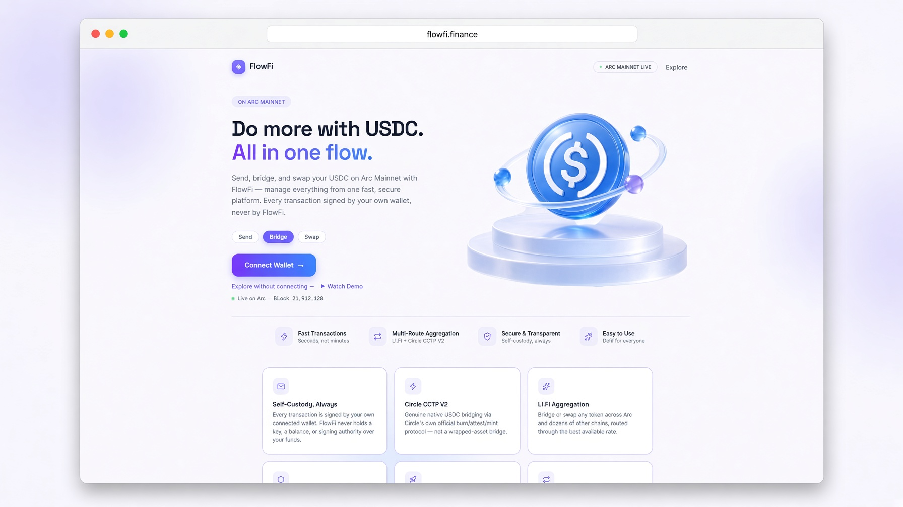
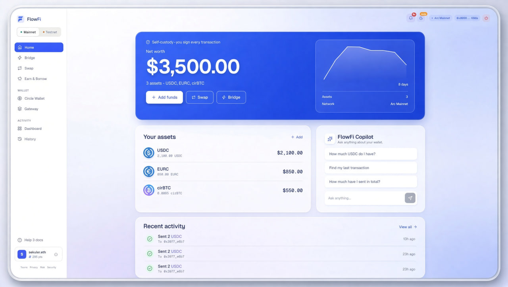
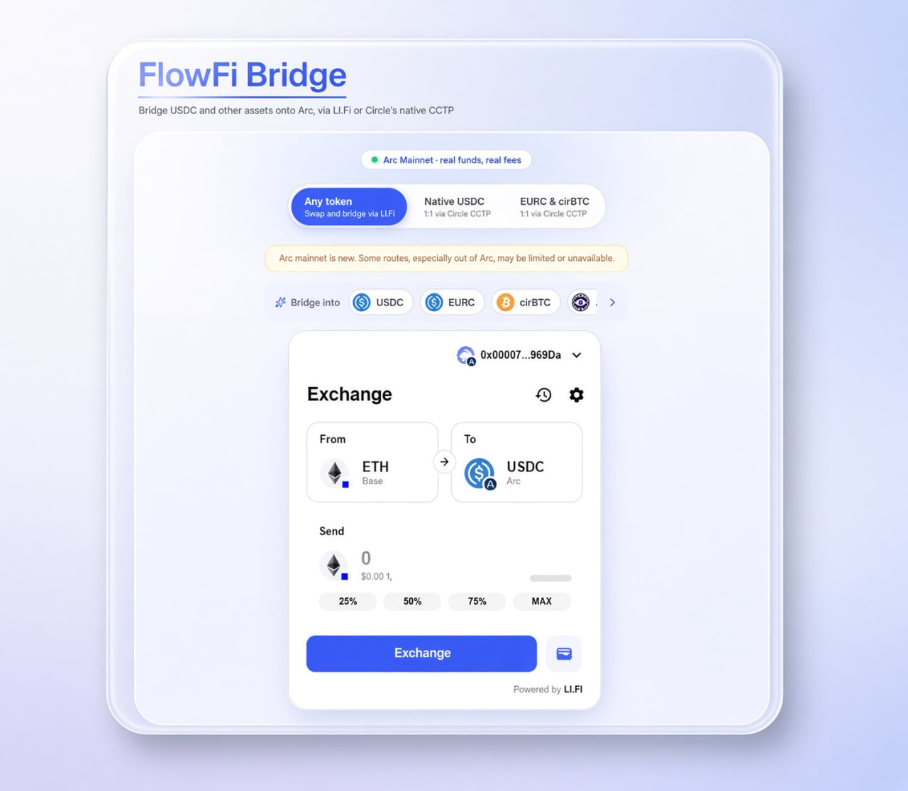
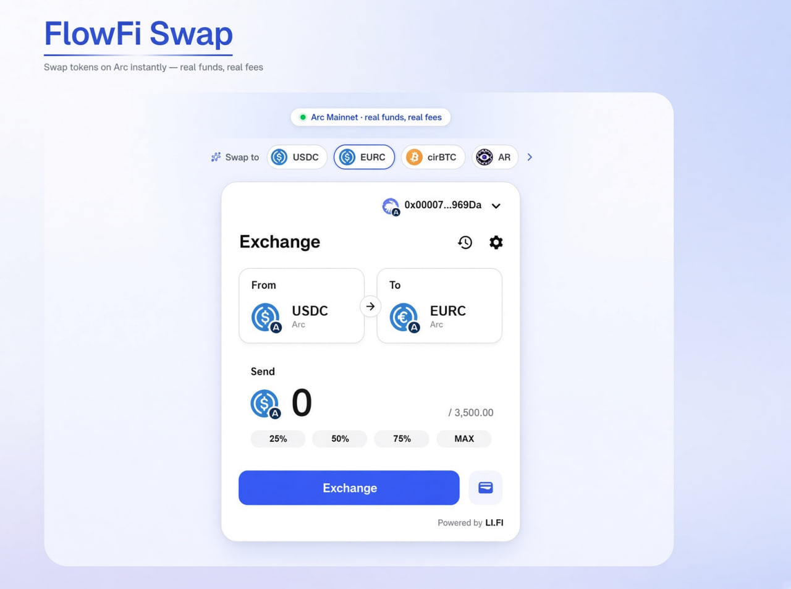
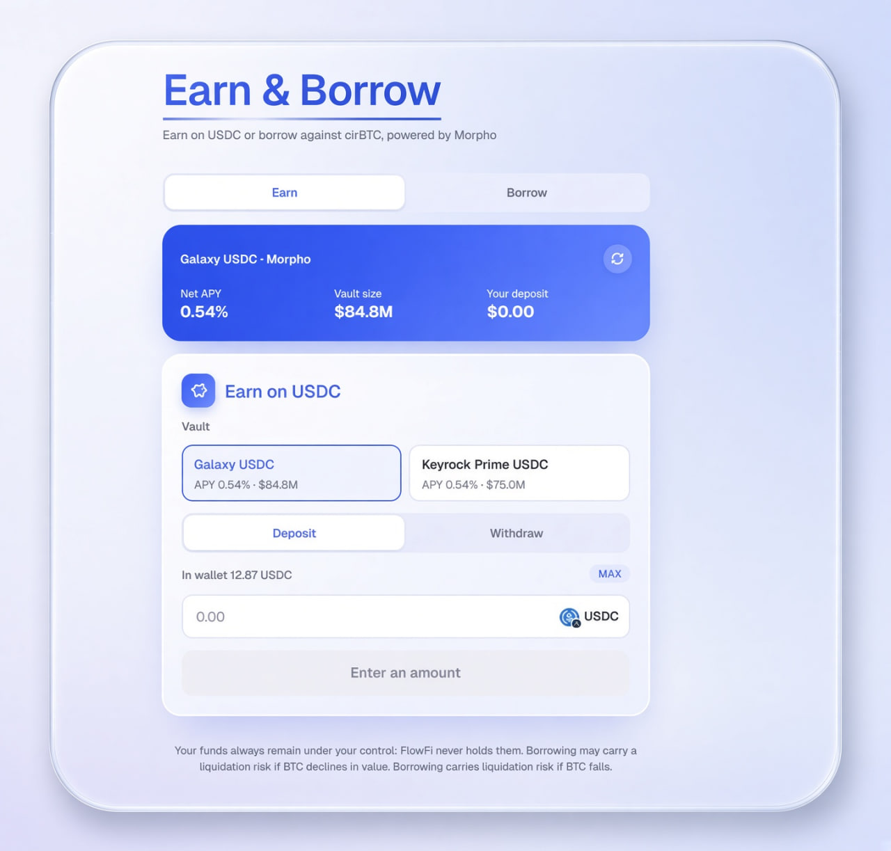
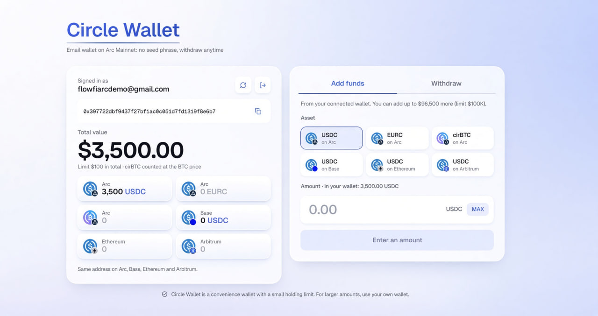
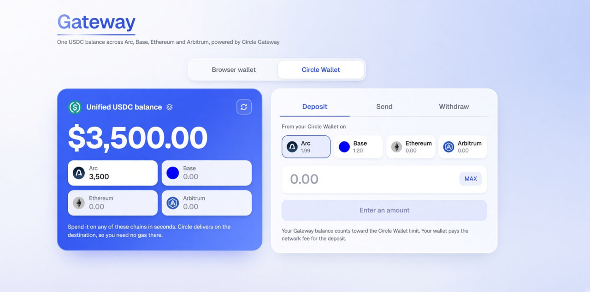
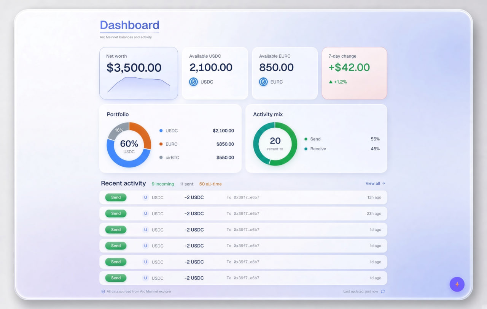
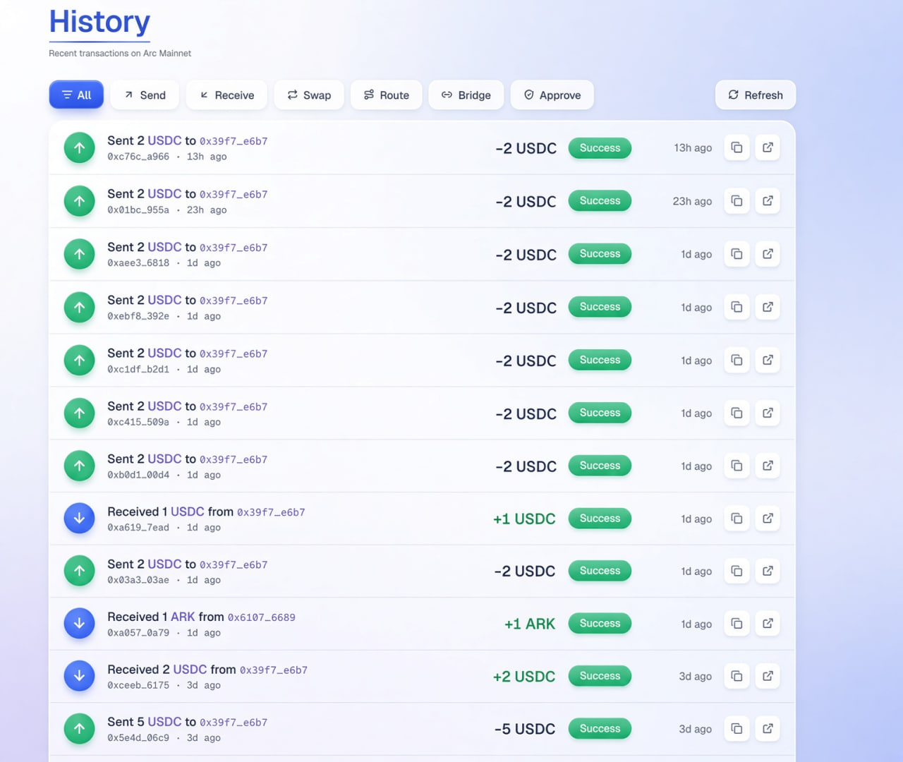

# FlowFi

Your dollars on Arc, all in one flow. Live on **Arc Mainnet**: a gasless native USDC bridge, native EURC and cirBTC bridging, swaps, a unified USDC balance with Circle Gateway, and Earn & Borrow on Morpho. A permissionless DeFi showcase (Token Launch, Liquidity Pools, AI Copilot actions) keeps running on **Arc Testnet**.

**Contracts:** [all addresses, mainnet and testnet](./ADDRESSES.md) · **App:** [flowfi.finance](https://flowfi.finance) · **Demo:** [youtu.be/Icu8qTiYMqw](https://youtu.be/Icu8qTiYMqw) · **Repo:** [github.com/sekuler/flowfi](https://github.com/sekuler/flowfi)

| | |
|---|---|
| **Gasless USDC bridge** | Circle CCTP V2 + Forwarding Service: sign once on the source chain, Circle mints on Arc, no Arc gas needed |
| **EURC & cirBTC** | Native burn-and-mint through Circle's CCTP for non-USDC, no wrapped tokens |
| **Circle Gateway** | One USDC balance across Arc, Base, Ethereum and Arbitrum, spendable on any of them in seconds |
| **Earn & Borrow** | Curated Morpho vaults for USDC and EURC; borrow USDC or EURC against cirBTC |
| **No FlowFi contracts on mainnet** | Every mainnet flow runs on Circle, Morpho and LI.FI contracts that were already live |
| **Safe 2-of-3** | Owns every privileged testnet contract |

[](https://github.com/sekuler/flowfi/actions/workflows/ci.yml)

> **Two environments, on purpose.** Mainnet (real funds) runs only on third-party infrastructure that was already live: Circle CCTP, Gateway and Wallets, Morpho, and LI.FI. Testnet (test assets, no monetary value) is where FlowFi's own contracts (Token Launch, Liquidity Pools, Swap) and the AI Copilot's transaction execution live as a full working showcase. See [SECURITY.md](./SECURITY.md) for the reasoning behind that split.

---

## Live on Arc Mainnet

| Feature | What it does |
|---|---|
| **Home** | Net worth in dollars, the assets held (USDC, EURC, USYC, cirBTC), quick actions for Add funds / Swap / Bridge, an "Ask your wallet" Copilot (read-only), and recent activity in plain language |
| **Bridge: Native USDC (gasless)** | Circle CCTP V2 `depositForBurnWithHook` with Circle's Forwarding Service, from 18 source chains. The user signs only on the source chain; Circle mints native USDC on Arc, so no Arc gas is needed. A transfer interrupted after the burn resumes without burning twice (`MessageTransmitterV2.usedNonces` is checked before any manual mint) |
| **Bridge: EURC & cirBTC** | Circle's CCTP for non-USDC (`CrossChainTokenService`): native burn-and-mint, no wrapped tokens. EURC from Ethereum, Base and Avalanche; cirBTC from Ethereum. The fee is paid in the source chain's gas token, so the full amount arrives |
| **Bridge: Any token** | Any asset onto or off Arc through LI.FI, with route comparison. Signed by the user's wallet |
| **Swap** | Same-chain swaps on Arc through LI.FI. Opens on USDC → EURC |
| **Earn** | Deposit USDC (Galaxy, Keyrock vaults) or EURC (Steakhouse, Gauntlet vaults) into curated Morpho vaults, with live APY, vault size and withdrawable amount |
| **Borrow** | Borrow USDC or EURC against cirBTC on Morpho Blue markets on Arc. Markets liquidate at 86% LTV; FlowFi caps new borrows and collateral withdrawals at 70% and shows live LTV, liquidation price and borrow rate. Every call is simulated before the wallet opens |
| **Gateway** | A unified USDC balance across Arc, Base, Ethereum and Arbitrum. Deposit from a browser wallet on any of them (from the Circle Wallet: on Arc), then Send or Withdraw to any other in seconds through an EIP-712 burn intent with Circle's Forwarding Service. Works from a browser wallet or the Circle Wallet |
| **Dashboard** | Net worth, live balances, portfolio split, activity mix and recent activity, read from the chain and Arc's Etherscan-run explorer (`arc.etherscan.io`) |
| **History** | Every transaction and token transfer on the address, including ones made in other apps, with amounts, status and explorer links |
| **AI Copilot (Mainnet)** | Answers questions about balances and activity and points to the right page; it never signs or executes anything itself on mainnet |

No FlowFi-deployed contract is involved in any of the above. The net-worth chart and 7-day change are drawn from daily snapshots saved in the user's own browser (not on a FlowFi server); until enough days have been recorded they say "Not enough history" instead of showing a made-up curve. USD values for EURC, USYC, and cirBTC use live prices; if a price can't be fetched, that token is left out of the dollar total rather than guessed.

**Mainnet contracts FlowFi reads or calls** (none deployed by FlowFi):

| Contract | Address |
|---|---|
| USDC (ERC-20 interface, 6 decimals) | `0x3600000000000000000000000000000000000000` |
| EURC *(Circle-official)* | `0xbEf5f6d51CB62b58e6A8f77868681825C6fe21c1` |
| USYC | `0x8a5D989Bbb96929F689B0200f435f53dA42bF490` |
| cirBTC *(Circle-official, 8 decimals)* | `0x171A4217b86A807A64eB94757Db6849fb4bDbAA0` |
| CCTP V2 TokenMessengerV2 *(Circle-official)* | `0x28b5a0e9C621a5BadaA536219b3a228C8168cf5d` |
| CCTP V2 MessageTransmitterV2 *(Circle-official)* | `0x81D40F21F12A8F0E3252Bccb954D722d4c464B64` |
| CCTP for non-USDC CrossChainTokenService *(Circle-official)* | `0x431871229103b780868f8C6BB820cd16ECf942BC` |
| Gateway Wallet *(Circle-official)* | `0x77777777Dcc4d5A8B6E418Fd04D8997ef11000eE` |
| Gateway Minter *(Circle-official)* | `0x2222222d7164433c4C09B0b0D809a9b52C04C205` |
| Morpho Blue | `0x34CD04070dD72b14E241112F6d83812Df5Af7fCD` |
| Morpho market cirBTC / USDC (LLTV 86%) | `0xc2db905f174e5defcce01d321b09f15f78856a36a21b90cc7e1abbc29225815d` |
| Morpho market cirBTC / EURC (LLTV 86%) | `0x6ea1ea96a1cc671615f3a3bdf51481c5b79e362a8b634396e680d1070137daf4` |
| Galaxy USDC vault | `0x8E357432CC12ff425c36432F312968aEb16112AF` |
| Keyrock Prime USDC vault | `0x5bEfAb92a5A3D60F578Cb51EEb4e4FD50a1e3123` |
| Steakhouse Prime EURC vault | `0xbeef00be37BdE921BAE06fad223125BAB16c41D1` |
| Gauntlet EURC Prime vault | `0x05863F54B05e96092069eF30c9Ca6060336e50B9` |

Morpho market parameters were verified onchain (`idToMarketParams`) and each vault's underlying asset checked before integration.

**Bridge routes LI.FI lists for USDC** (LI.FI `/v1/connections`, checked 21 Sep 2026)

| Chain | Arc → chain | chain → Arc |
|---|---|---|
| Base | ✅ | ✅ |
| Ethereum | ✅ | ✅ |
| Arbitrum | ✅ | ✅ |
| Optimism | ✅ | ✅ |
| Polygon | ✅ | ✅ |

A listed connection means LI.FI knows a path for that USDC pair. It does not guarantee liquidity at every amount, and routes can change. Arc mainnet is new, so availability may vary.

## Full showcase on Arc Testnet

| Feature | What it does |
|---|---|
| **Circle Wallet (Testnet)** | The original testnet Developer-Controlled Wallet flow, kept alongside the mainnet version for demos with no real funds |
| **Bridge & Gateway (Testnet)** | One page, two modes. Bridge: genuine cross-chain USDC transfer via Circle's official burn/attest/mint CCTP V2 protocol — Arc, Ethereum Sepolia, Base Sepolia, Arbitrum Sepolia. Gateway: a unified USDC balance via Circle's Gateway protocol — deposit once, held as one pooled balance instead of four separate on-chain balances. Both work from either a browser wallet or the Circle Wallet |
| **Smart Swap** | USDC ⇄ EURC with an AI advisor that reads real pool liquidity and warns before a swap moves the price too much |
| **Permissionless Token Launch** | Deploy your own ERC-20 on Arc and open its own trading pool immediately — no waiting on anyone's approval, scoped so it never touches the curated pools' security model |
| **Liquidity Pools** | A working showcase pool (USDC/EURC) demonstrating the swap rail — anyone can add/remove liquidity or swap against it |
| **Stablecoin Analytics** | Live, on-chain TVL and distribution across every FlowFi testnet contract |
| **AI Copilot (Testnet)** | Type what you want — "swap 10 USDC to EURC", "send 20 USDC to 0x..." — Copilot parses it and executes the on-chain transaction directly, signed by the connected wallet |
| **AI Market Analysis** | Ask "analyze BTC" or "analyze Morpho" and get real technical analysis (RSI, EMA, MACD, pivot support/resistance across 1H/4H/1D/1W/1M) and tokenomics/unlock data — all numbers computed server-side from live data, with the AI only writing the interpretive summary, never the figures. Works from either environment |

---

## Smart contracts (Arc Testnet)

The live testnet product surface only — every `onlyOwner` contract here is owned by a 2-of-3 Safe multisig (`0xa50FFedfC93eDB81F8Bcc23507db8aDdE7EE8Be0`), not a single wallet. Superseded/legacy versions (still live on-chain, no longer where the app sends traffic) are documented separately in [`contracts/LEGACY.md`](./contracts/LEGACY.md), not deleted from the record. Arc Mainnet has no equivalent FlowFi contracts: mainnet flows use Circle, Morpho and LI.FI contracts only.

| Contract | Address |
|---|---|
| Pool Factory v4c *(current — where new pools actually get created)* | `0xD2dC496dcf4e6D8c9CFc710AC5C9A6Dc941CBbB0` |
| Launch Pool Factory *(permissionless, but only for tokens minted through Token Factory below — see [`contracts/README.md`](./contracts/README.md); not yet independently reviewed)* | `0x2b3B2E69C14DA2558E3ce6e2d58c04b2147E5ec0` |
| Token Factory (v2) | `0x1Fe800a2663988C043e4a9A393651f18Cd49D998` |
| USDC (Arc Testnet) | `0x3600000000000000000000000000000000000000` |
| EURC | `0x89B50855Aa3bE2F677cD6303Cec089B5F319D72a` |
| CCTP V2 TokenMessengerV2 *(Circle-official)* | `0x8FE6B999Dc680CcFDD5Bf7EB0974218be2542DAA` |
| CCTP V2 MessageTransmitterV2 *(Circle-official)* | `0xE737e5cEBEEBa77EFE34D4aa090756590b1CE275` |
| Gateway Wallet *(Circle-official)* | `0x0077777d7EBA4688BDeF3E311b846F25870A19B9` |
| Gateway Minter *(Circle-official)* | `0x0022222ABE238Cc2C7Bb1f21003F0a260052475B` |

All verified and viewable on [Arcscan Testnet](https://testnet.arcscan.app). Arc Mainnet activity is viewable on [arc.etherscan.io](https://arc.etherscan.io). Full security review: [`SECURITY.md`](./SECURITY.md). CCTP/Gateway addresses confirmed against [Arc's official contract addresses page](https://docs.arc.io/arc/references/contract-addresses) and [Circle Gateway docs](https://developers.circle.com/gateway).

One more deployed and verified contract, Escrow v4, isn't in the table above because it isn't wired into the app yet — see [`contracts/README.md`](./contracts/README.md) for it.

---

## Verified receipts — real transaction hashes

Every claim above is checkable on-chain. Rather than asking anyone to take our word for it, here are real transaction hashes from live demo runs — click through to the relevant explorer to see them settle.

**Mainnet demo videos**
- [FlowFi on Arc Mainnet, full walkthrough (Sept 2026)](https://youtu.be/Icu8qTiYMqw)
- [Native USDC bridge (Base → Arc, CCTP V2 burn & mint)](https://youtu.be/j5hJ95oeA7E)
- [Any-token bridge via LI.FI (Base ETH → Arc USDC)](https://youtu.be/f4Luu0ic3ek)

**Mainnet — Native USDC bridge via Circle CCTP V2 (Base → Arc), 1 USDC, 21 Sep 2026**
| Step | Tx hash |
|---|---|
| Source burn (Base) | [`0x4432dba5df285033b804b26baa583d6bee874ceca209e73b700b8fe53d96a70a`](https://basescan.org/tx/0x4432dba5df285033b804b26baa583d6bee874ceca209e73b700b8fe53d96a70a) |
| Destination mint (Arc) | [`0xf5cf3b1847b5dc8899ae6855a48ff86dfd1031c09343e4d91cee5614e4bef449`](https://arc.etherscan.io/tx/0xf5cf3b1847b5dc8899ae6855a48ff86dfd1031c09343e4d91cee5614e4bef449) |

Standard transfer (Circle destination domain 26). The burn and the mint are about 25 minutes apart.

**Demo 1 — Cross-chain bridge, Testnet (Ethereum Sepolia → Arc)**
| Step | Tx hash |
|---|---|
| Source burn (Ethereum Sepolia) | [`0x2920de716bea703082e373d6b711354f6ce4d5076a1783fdb73e0094adfecc51`](https://sepolia.etherscan.io/tx/0x2920de716bea703082e373d6b711354f6ce4d5076a1783fdb73e0094adfecc51) |
| Destination mint (Arc) | [`0x77a9b887dadd47dd6a80d029d8aedee659f730e529ab4a624dd8518226d61695`](https://testnet.arcscan.app/tx/0x77a9b887dadd47dd6a80d029d8aedee659f730e529ab4a624dd8518226d61695) |

**Demo 2 — Circle Developer-Controlled Wallet executing a swap on Arc, Testnet**
| Step | Tx hash |
|---|---|
| On-chain execution | [`0x0226fc2c8b4cd4000bd25c6aea358f553aed9e69cc69b36582c0b2c7568146c0`](https://testnet.arcscan.app/tx/0x0226fc2c8b4cd4000bd25c6aea358f553aed9e69cc69b36582c0b2c7568146c0) |

All transactions were confirmed successful on their respective explorers as of this writing. See [`docs/demo.md`](./docs/demo.md) for a full walkthrough.

---

## Why Arc?

FlowFi is designed around stablecoins, not speculation.

Being honest about it: CCTP V2 and Circle Developer-Controlled Wallets aren't Arc-exclusive — they work on other supported EVM chains too. What's actually Arc-specific is what happens after funds arrive. USDC is Arc's native gas asset, not a wrapped placeholder bolted onto a general-purpose chain — so cross-chain USDC becomes immediately productive the moment it lands, with no synthetic-asset discount and no "why is gas a random token" friction to explain away.

FlowFi is built around that arrival point: bridging, swaps, Gateway and Earn & Borrow all settle through the same native-USDC rail, and the Morpho markets and vaults FlowFi uses live on Arc itself.

There's a second, independent reason Arc specifically: it runs on Malachite, a consensus engine built for sub-second deterministic finality — once a transaction confirms, it's final, no reorg risk. That's not a Circle-product claim that applies elsewhere; it's Arc's own chain-level property, and it's why FlowFi doesn't need to hedge language like "should be confirmed" around settlement.

---

## Architecture

**Mainnet: real funds, no FlowFi contracts:**

```
┌──────────────────────────────────────────────────┐
│                     Frontend                      │
│             React + TypeScript + viem             │
└───────────────┬──────────────────────┬────────────┘
                │                      │
      ┌─────────▼─────────┐  ┌─────────▼──────────┐
      │  Browser Wallet    │  │   Circle Wallet     │
      │  (EIP-6963, WC)    │  │ email OTP, Vercel   │
      │  user signs        │  │ API + allowlist     │
      └─────────┬─────────┘  └─────────┬──────────┘
                └──────────┬───────────┘
   ┌───────────────────────▼────────────────────────┐
   │ Circle CCTP V2 + Forwarding · CCTP non-USDC ·   │
   │ Circle Gateway · Morpho Blue + vaults · LI.FI   │  ← third-party, already live
   └───────────────────────┬────────────────────────┘
                   ┌───────▼────────┐
                   │   Arc Mainnet   │
                   └────────────────┘
```

**Testnet — full FlowFi-built showcase:**

```
┌─────────────────────────────────────────────┐
│                  Frontend                    │
│        React + TypeScript + viem             │
└──────────────────┬────────────────────────────┘
                    │
        ┌───────────┼────────────┐
        │           │            │
┌───────▼──────┐ ┌──▼─────────┐ ┌▼─────────────┐
│ Browser Wallet│ │Circle Wallet│ │  AI Copilot  │
│ (EIP-6963)    │ │(no seed phr)│ │(Claude Sonnet)│
└───────┬──────┘ └──┬─────────┘ └┬─────────────┘
        │           │            │
        └───────────┼────────────┘
                     │
       ┌─────────────▼──────────────┐
       │      Arc Testnet (L1)       │
       │  Swap · TokenFactory ·      │
       │      PoolFactory            │
       └─────────────┬───────────────┘
                      │ CCTP V2
       ┌──────────────┼───────────────┐
       │              │               │
┌──────▼─────┐ ┌──────▼─────┐ ┌───────▼──────┐
│ Eth Sepolia│ │Base Sepolia│ │Arbitrum Sepolia│
└────────────┘ └────────────┘ └────────────────┘
```

---

## Screenshots

| | |
|---|---|
| **Landing**<br>Connect a wallet, sign in with email, or explore |  |
| **Home**<br>Net worth, assets, Copilot, recent activity |  |
| **Bridge**<br>Gasless native USDC, EURC & cirBTC, any token via LI.FI |  |
| **Swap**<br>Same-chain swaps on Arc, opens on USDC → EURC |  |
| **Earn & Borrow**<br>Morpho vaults for USDC/EURC, borrow against cirBTC |  |
| **Circle Wallet**<br>Email sign-in, balances on four chains, add funds / withdraw |  |
| **Gateway**<br>One USDC balance across four chains: deposit, send, withdraw |  |
| **Dashboard**<br>Net worth, portfolio split, activity mix |  |
| **History**<br>Every transaction with status and explorer links |  |

These are the Arc Mainnet screens. The Testnet showcase (Token Launch, Liquidity Pools, Stablecoin Analytics, Copilot actions) is in the same app under the Testnet menu.

---

## Data sources

FlowFi's market analysis never uses AI-generated numbers — every figure comes from a real source:

| Data | Source | Notes |
|---|---|---|
| Price, market cap, volume, supply | [CoinGecko](https://coingecko.com) | Free tier |
| RSI, EMA, MACD, support/resistance | Computed server-side | Standard formulas, real historical OHLCV — not AI-generated |
| Mainnet net-worth prices (EUR/USD via EURC, USYC, BTC via cirBTC) | [CoinGecko](https://coingecko.com) | A token with no live price is left out of the dollar total, not guessed |
| Token unlock/vesting schedules | 57 tokens manually curated from [DeFiLlama](https://defillama.com), cross-checked against official project docs — plus live data from the DropsTab API for any token they track | Manual list is the fallback; DropsTab is checked first |

If a data point isn't available from a real source, FlowFi says so rather than guessing.

---

## Tech stack

- **Frontend** — React, TypeScript, Vite
- **Chain interaction** — [viem](https://viem.sh)
- **Wallets** — EIP-6963 (MetaMask, Rabby, etc.), WalletConnect for mobile browsers, and Circle Developer-Controlled Wallets with email sign-in
- **Mainnet routing** — Circle CCTP V2 + Forwarding Service (gasless USDC), CCTP for non-USDC (EURC, cirBTC), Circle Gateway (unified balance) and LI.FI (bridge/swap aggregation)
- **Earn & Borrow** — Morpho Blue markets and Morpho vaults (ERC-4626), called directly with viem
- **Testnet bridging** — Circle CCTP V2
- **AI** — Claude Sonnet, used for natural-language transaction parsing, swap risk analysis, and market analysis summaries (never for computing the underlying numbers)
- **Charts** — lightweight-charts
- **Hosting** — Vercel

---

## Running locally

```bash
git clone https://github.com/sekuler/flowfi.git
cd flowfi
npm install

cp .env.example .env
# then fill in:
# ANTHROPIC_API_KEY=       (server-side only — no VITE_ prefix, or it gets bundled into client-side JS)
# CIRCLE_API_KEY=          (Testnet Circle Wallet)
# CIRCLE_ENTITY_SECRET=
# CIRCLE_LIVE_API_KEY=     (Mainnet Circle Wallet, server-side only)
# CIRCLE_LIVE_ENTITY_SECRET=
# WALLET_AUTH_SECRET=      (signs the Testnet Circle Wallet session cookie)
# CIRCLE_LIVE_AUTH_SECRET= (signs the Mainnet Circle Wallet session cookie — must differ from the one above)
# RESEND_API_KEY=          (sends the email sign-in codes)
# VITE_LIFI_API_KEY=       (client-exposed by design, like a publishable key — powers Mainnet Bridge/Swap)
# ETHERSCAN_API_KEY=       (server-side only — powers Mainnet Home/Dashboard/History activity and token-transfer reads via arc.etherscan.io)
# DROPSTAB_API_KEY=        (optional — live token unlock data; falls back to the manual list without it)
# ARC_RPC_URL=             (optional — a keyed RPC provider for Arc Testnet; falls back to the public RPC)
# ARC_MAINNET_RPC_URL=     (optional — falls back to Arc's own public mainnet RPC)
# UPSTASH_REDIS_REST_URL=  (required for Circle Wallet sign-in and for rate limiting on every backend
# UPSTASH_REDIS_REST_TOKEN= endpoint; in production /api/claude, /api/rpc-proxy and /api/upload-image refuse to run without it)

npm run dev
```

Local dev defaults to Arc Testnet for the full showcase — no real funds are ever involved there. Get test USDC from [faucet.circle.com](https://faucet.circle.com). Mainnet features (Home, Bridge, Swap, Earn & Borrow, Gateway, Dashboard, History) work locally too, against real Arc Mainnet, the moment a browser wallet is connected — same as production.

---

## Testing

Contracts have a Foundry test suite covering the fixes documented in [`SECURITY.md`](./SECURITY.md) — the ArcEscrow refund loophole, ArcSwap's withdrawLiquidity/setRate restrictions, and ArcPool's fee-on-transfer and non-standard-token (USDT-style) handling — plus happy-path coverage for each contract.

```bash
curl -L https://foundry.paradigm.xyz | bash
foundryup

forge install foundry-rs/forge-std --no-git --no-commit
forge test -vv
```

CI ([`.github/workflows/ci.yml`](./.github/workflows/ci.yml)) runs this suite plus a frontend type-check (`tsc --noEmit`) on every push and pull request to `main`.

---

## Known Limitations

FlowFi's own Testnet contracts have been through a manual security review, not a professional third-party audit. Deliberate design trade-offs from that review (no oracle on ArcSwap's pricing, no TWAP on pools, no admin kill-switch on individual pools by design) are documented in full — not hidden — in [`SECURITY.md`](./SECURITY.md). Mainnet real-money flows sidestep this question by never running a FlowFi contract in the first place — see [`SECURITY.md`](./SECURITY.md) for the full reasoning.

---

## Roadmap

- [x] Gasless USDC bridging, EURC & cirBTC rails, Circle Gateway, Circle Wallet and Earn & Borrow on mainnet
- [ ] Card funding straight to Arc
- [ ] AI Copilot actions on mainnet, with confirm-before-sign
- [ ] More assets and Gateway chains as Circle adds them
- [ ] Mainnet Liquidity Pools / Token Launch, revisited once an independent review is in place

**Not on the roadmap:** Perpetuals was fully removed (app, Copilot, and frontend code) after a security review found no oracle backs the pricing. A contract from that era is still deployed and verified on Arcscan for historical/audit reference, but there's no plan to rebuild the feature without a real decentralized oracle integration.

---

## Legal

- [`TERMS.md`](./TERMS.md) — what you're agreeing to by using FlowFi
- [`PRIVACY.md`](./PRIVACY.md) — what data is collected, by whom, and why
- [`RISK.md`](./RISK.md) — mainnet-specific risks (wrong network, third-party routing, no undo)
- [`SECURITY.md`](./SECURITY.md) — the security self-review and mainnet trust model

These are also linked from the app itself (sidebar footer).

---

## Disclaimer

Arc Mainnet features move real USDC and other assets. Browser-wallet flows are signed by the user's own wallet, at the user's own discretion. The mainnet Circle Wallet is a Circle Developer-Controlled Wallet: FlowFi's backend signs on the user's behalf only for an allowlisted set of actions, holdings are capped, and withdrawals to the user's own wallet are always available. Earn & Borrow use third-party Morpho vaults and markets; returns are variable and borrowing carries liquidation risk. The Testnet showcase runs with test assets that carry no monetary value. An earlier Perpetuals contract remains deployed and verified on Arcscan for historical reference — it was fully removed from the app and isn't reachable through the product; if you interact with its bytecode directly, be aware its pricing was client-submitted with no decentralized oracle behind it. See [`TERMS.md`](./TERMS.md), [`PRIVACY.md`](./PRIVACY.md), and [`RISK.md`](./RISK.md) for the full terms.
